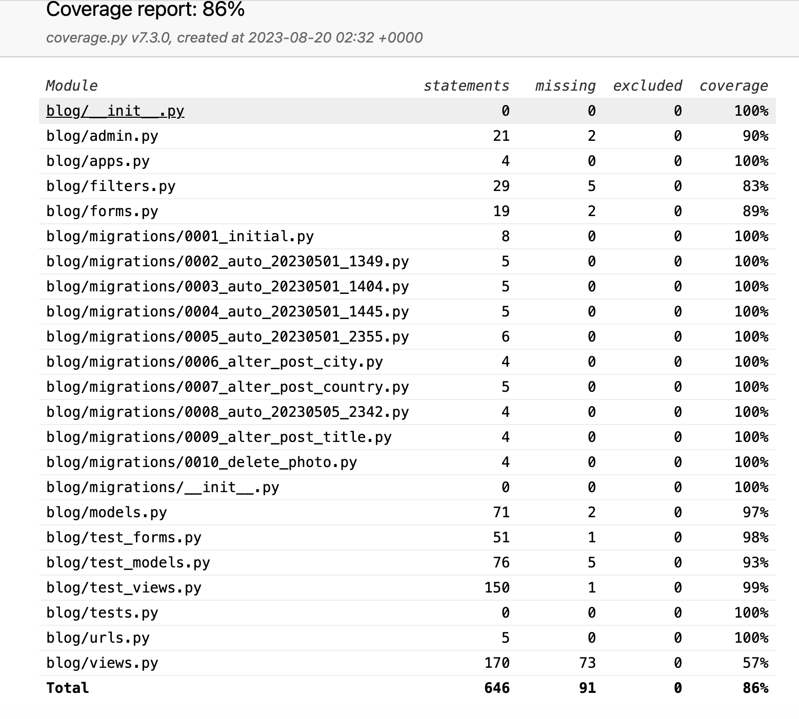
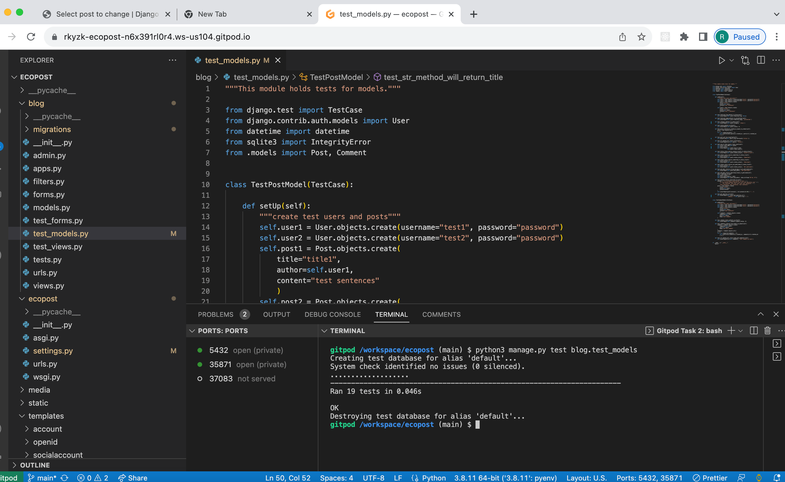
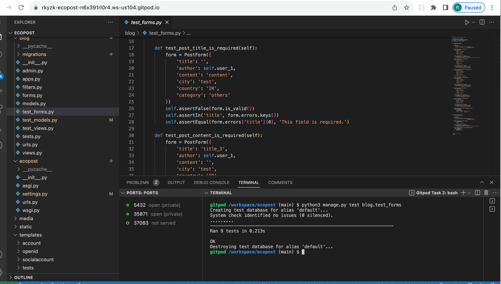
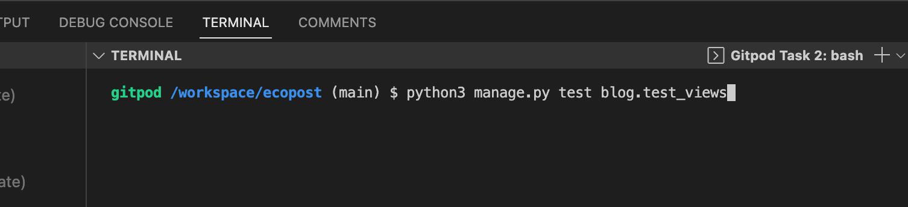
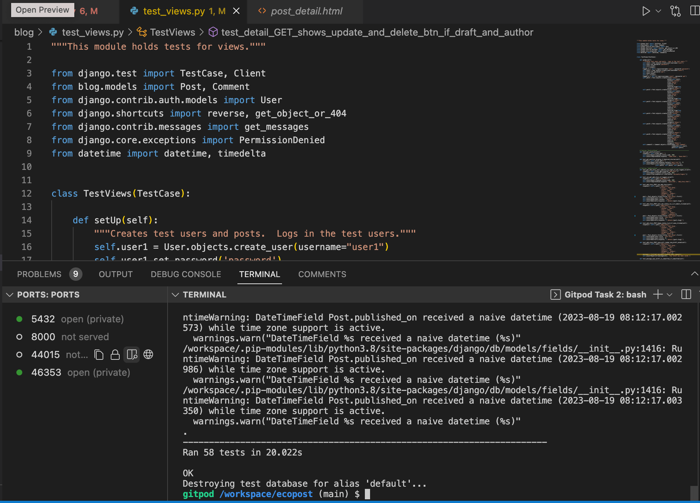

Automated tests are listed below.  They all passed. 
According to the coverage report  
- 89% of blog/forms.py was covered.
- 97% of blog/models.py was covered.
- 57% of views.py was covered.

Manual tests complement most of the aspects that weren't covered by automated tests.

#### Test models (test_models.py)

Post model
1. featured flag is set to false by default
2. featured image is set to string data ‘placeholder’ by default
3. category is set to ‘Others’ by default
4. status is set to 0 (draft) by default 
5. posts will be ordered from newest to oldest created date (created_on)
6. post will have a slug starting with the title
7. the string method will return the title
8. ‘num_of_likes’ will equal likes count
9. post with status 0 returns status the value of ‘Saved as draft’
10. post with status 1 returns the value of ‘Submitted'
11. post with status 2 returns the value of ‘Published’
12. pub_date will return string ‘Not published’ if not published. 
13. pub”_date returns date in the format %B %d, %Y" if published.
14. excerpt returns the first 200 characters of the post content
15. get_absolute_url method will return ‘/detail/‘ + slug + ‘/‘

Comment model
1. comment status is set to 0 by default
2. comments are ordered by oldest to newest created date
3. The string ‘method of comment will return “comment body by title”

#### Test forms (test_forms.py)

Post form
1. The title is required.
2. The content is required.
3. The featured image is not required.
4. The category is required.
5. The city is required.
6. Country is required.
7. The form fields are explicit.

Comment Form
1. The comment body is required.
2. The comment fields are required.

#### Test views (test_views.py)

- PostListView
1.  The home page will be rendered.
2. Three featured stories will be rendered.

- AddStoryView 
  1. If not signed in, users attempting to get to ‘Write Stories’ will be redirected to sign in page.
2. Logged in users can get to ‘Write Stories’. 
3. A post can be created.
  4. The post will have status ‘Submitted’ if ‘Submit’ button is clicked.
5. If ‘Save’ button is clicked, the post will have the status 0 (’draft’)
6. Saving a draft will render a message, ‘Your draft has been saved.'
7. Submitting a draft will render a message, “You submitted your post. We'll contact you when decision has been made."

- PostDetailView 
1. PostDetail view will render the detail page
  2.  When the get method is called, ‘liked’ will be set to false if the user isn’t logged in or hasn’t liked the post
3.  When the get method is called, ’liked’ will be set to true if the user has liked the post
4. When the post method is called, ‘liked’ will be set to false if the user isn’t logged in or hasn’t liked the post
5.  When the post method is called, ’liked’ will be set to true if the user has liked the post
6.   When the get method is called, ‘bookmarked’ will be set to false if the user isn’t logged in or hasn’t bookmarked the post
7.  When the get method is called, ‘bookmarked’ will be set to true if the user has bookmarked the post
8. When the post method is called, ‘bookmarked’ will be set to false if the user isn’t logged in or hasn’t bookmarked the post
9.  When the post method is called, ‘bookmarked’ will be set to true if the user has bookmarked the post
10. comment can be created.
11.  When a comment is posted, a message “You posted a comment.” will be displayed.)
12. The validation will throw an error message if only a space is entered for the comment.
13. If the post is draft status and the user is the owner of the post, update and delte buttons are displayed.
14.  If the post is submitted and the user is the owner of the post, update and delte buttons won’t be displayed.
15. If the post is published and the user is the owner of the post, update and delte buttons won’t be displayed.
16. If the user is not the owner of the post, update and delte buttons won’t be displayed.

- PostLikeView
17.  Logged in user can ‘like’ a post
18. Sending a post request to post like view for the second time will ‘unlike’ the post. 

- BookmarkView
1. Logged in user can bookmark a post
2. Sending a post request to bookmark view for the second time will undo the bookmarking.

- UpdateCommentView
1. The writer of the comment can get to ‘Update Comment’ page.
2. Trying to get to ‘Update Comment’ while not log in will redirect to the log in page.
3. Trying to get to ‘Update Comment’ of another user’s comment will redirect to 403 page 
4. Logged in users can update their own comments.

- DeleteCommentView
1. Deleting comments will set comments status to 2 (‘deleted’)

- UpdatePostView
1. The author of the post can get ‘Update Post’ page of their posts if logged in.
2. If not logged in, trying to get ‘Update Post’ page will redirect to the login page
3. Trying to get ‘Update Post’ page of another user’s post will redirect to 403 page. 
4. Trying to get ‘Update Post’ page of submitted posts will redirec to 403 page.
5. Trying to get ‘Update Post’ page of published posts will redirec to 403 page.
6. The title of the post can be updated.
7. The content of the post can be updated.
8. The city can be updated.
9. The country can be updated.
10. The category can be updated.
11. Canceling update will not update the post.
12. The feedback message will say the change has been saved if the post is updated.
13. Submitting the post on ‘Update Post’ page will set the post status to 1 (‘Submitted’)

- DeletePostView
1. Posts can be deleted if the user is the writer of the posts.
2. Trying to delete others’ posts will redirect to 403 page
3. Trying to delete others’ posts will not delete the posts.
4. Trying to delete submitted posts will redirect to 403 page.
5. Trying to delete published posts will redirect to 403 page.

- MoreStoriesView
1. More stories page can be displayed.
2. More stories page filter the correct posts (posts published in the previous 7 days)

- PopularStoriesView
1. Popular stories page can be displayed.
2. Popular stories page filter the correct posts.

- MyPageView
1. Logged in users can get their own ‘My Page’
2.  Trying to get another user’s ‘My Page’ will redirect 403 page.

**Screenshots**

- test_models.py

- test_forms.py

- test_views.py

